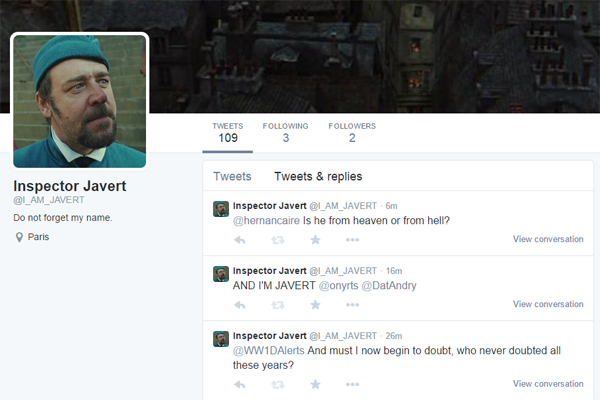

JavertBot
==========================

Les Misérables is my favorite Broadway musical, and I wanted to create a Twitter bot that emulates one of the most famous personalities from the musical. As a result, I created a Twitter bot which mimics the personality of Inspector Javert through the Twitter handle @I\_AM\_JAVERT. Every 10 minutes, @I\_AM\_JAVERT posts a random Javert quote from the musical in the form of a Twitter reply.

@I\_AM\_JAVERT randomly selects one of three pre-defined communities and selects a post to generate a reply to. For instance, I poll Twitter for the query "Les Miserables" and randomly select a tweet to reply one of Javert's quotes to. I also search through the recently trending hashtags and randomly post a quote that's in the form a question to create a discussion. In addition to these broad communities and trends, I also interact with the hashtag "#bread" by posting a quote relating to hunger and starvation from the musical. A big part of the musical was based on Javert chasing after Jean Valjean, a criminal who broke his parole by stealing a loaf of bread. As a result, I wanted my Twitter personality to be somewhat fanatical over bread to give it a dimension of personality.

In addition to interacting with the three communities mentioned above, @I\_AM\_JAVERT also interrupts peoples' conversations. One of Javert's most famous quotes from the musical is his saying "And I'm Javert!" from the musical number ["Prologue: Work Song"](http://youtu.be/I8WSysB5vKM?t=49s ""Prologue: Work Song""). To emulate this behavior, I search the term "my name is" in Twitter to find two people trying to talk to each other. I then filter my query to select a tweet which is a part of a conversation between two people. After finding two people who are talking to each other, I tweet "AND I'M JAVERT" and tag both of their handles in the status. This has resulted in @I\_AM\_JAVERT interrupting people's conversations. Most people didn't respond to these tweets, but there were people who were confused and/or entertained by Javert joining their conversation.

Most of the resulting conversations from this bot are nonsensical, and the bot often replies to tweets that are in languages other than English. However, it produces some entertaining exchanges, and many of them can be [found here](http://i.imgur.com/gf337c1.png "found here").

Overall, this project has been very successful. The bot has a few followers and several of its tweets have been favorited, retweeted, and responded to. Most people think of automated bots as simply programs or machines that do not have any personalities, but there are various programs which can emulate human elements, characters, and people. While Inspector Javert is not a real person, his spirit becomes personified as he ends up on Twitter.

And someday, he'll find Jean Valjean.